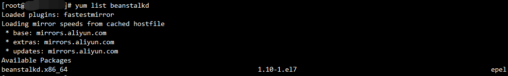
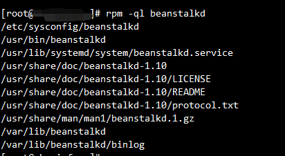

## Beanstalk
#### 是一款轻量级的快速消息队列，具有通用的接口，其最初的目的是通过异步运行耗时的任务来减少高容量Web应用程序中页面视图的延迟，其基于管道(tube)和任务(job)的工作队列。支持任务优先级(priority),延时 (delay),超时重发 (time-to-run)和预留(buried),能够很好的支持分布式的后台任务和定时任务。

### 1.安装（以CentOS为例）
在CentOS上可以直接使用yum安装
>yum list beanstalkd

>yum install beanstalkd

查看Beanstalk安装目录
>rpm -ql beanstalkd

将Beanstalk注册为系统服务
>cp /usr/lib/systemd/system/beanstalkd.service /etc/init.d/

>service beanstalkd start

查看Beanstalk是否启动
>netstat -a | grep 11300

### 2.简单使用(详细代码请见src文件夹)
此处使用PHP-Beanstalk客户端beanstalk
>beanstalk-https://github.com/davidpersson/beanstalk

运行生产者向队列中抛入一个job
然后运行消费者读取生产者抛入的job数据

